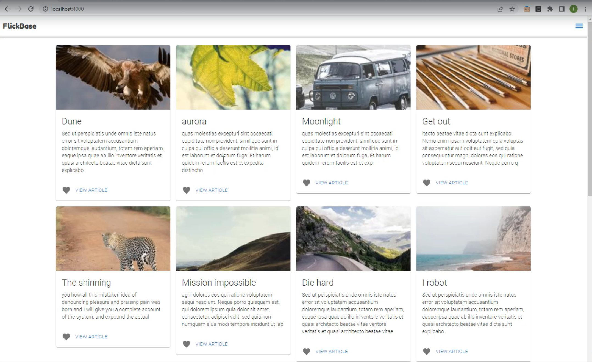

# Flickbase

Flickbase is a picture-sharing web application built using the MERN stack (MongoDB, Express, React, Node.js). It allows users to post photos, share experiences, and engage with content. The app features two roles: Admin and Client. Admin users have additional permissions to manage content and users, while clients can browse, post, and interact with photos.

### Docker Container Created

### Dockerizing Process

## Table of Contents

- [Features](#features)
- [Tech Stack](#tech-stack)
- [Installation](#installation)
- [Usage](#usage)
- [Environment Variables](#environment-variables)
- [API Endpoints](#api-endpoints)

## Features

- **User Authentication**: Secure login and registration using JWT tokens.
- **Admin and Client Roles**: Admins have permissions to manage users and content.
- **Photo Upload**: Users can upload photos and share experiences.
- **Infinite Scroll**: Smooth loading of photos using the react-infinite-scroll-component.
- **State Management**: Managed using React reducers and Redux Toolkit.
- **Material UI**: Modern UI components for an enhanced user experience.
- **Image Color Analysis**: Extracts dominant colors from images using react-palette.

## Tech Stack

- **Frontend**: React, Redux Toolkit, Material-UI, Axios, React Infinite Scroll Component, React Palette
- **Backend**: Node.js, Express, MongoDB, Mongoose, JWT Authentication
- **Other**: Docker for containerization, GitHub Actions for CI/CD

## Installation

- Clone the repository: `git clone https://github.com/yashmahaja/Flickbase.git` and navigate to the        project directory using `cd Flickbase`. 
- Install dependencies for the server by navigating to the server directory using `cd server` and running `npm install`. 
- Next, install dependencies for the client by navigating to the client directory using `cd ../client` and running `npm install`. 
- Create a `.env` file in the server folder and add the following environment variables: `PORT=3001`, `MONGODB_URI=your_mongodb_connection_string`, and `JWT_SECRET=your_jwt_secret`.

## Usage

- Start the server by navigating to the server directory with `cd server` and running `npm run server`. - - Start the client by navigating to the client directory with `cd ../client` and running `npm start`. 
- To run both client and server concurrently, use the command `npm run dev`.
- Access the app in your browser at `http://localhost:3000`.

## Environment Variables

The project requires the following environment variables: `PORT` (Port number for the server), `MONGODB_URI` (MongoDB connection string), and `JWT_SECRET` (Secret key for JWT authentication).

## API Endpoints

- **User Authentication**: 
- `POST /api/auth/register` Register a new user, 
- `POST /api/auth/login` Login a user and receive a JWT token.
- `GET /api/photos` - Get all photos,
- `POST /api/photos` - Upload a new photo (Admin/Client).
- `GET /api/admin/users` - Manage users (Admin).

